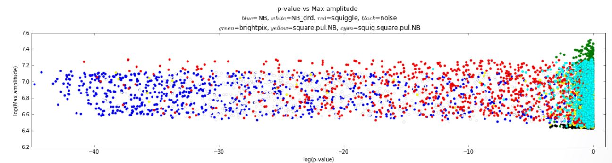

# Machine Learning Using SETI data
[SETI (Search for Extraterrestrial Intelligence)](https://www.seti.org/) Institute is dedicated to answering one of the most interesting questions – is there intelligent life elsewhere in the universe? To this end it runs the [Allen Telescope Array](https://www.seti.org/seti-institute/project/details/fact-sheet), a radio telescope array in Hat Creek Radio Observatory, northern California, which observes radio signals from distant stars and nebulae.

 ?raw=true

## Table of Contents
  - [GitHub1](#github1)
  - [GitHub2](#github2)

Their existing detection software does a simple real-time search for signals that are greater than the average noise. If it persists for more than a few seconds then the software flags the observation and calls for human intervention. Needless to say, this is a very broad classification and catches all types of signals with no regard to their periodicity, uniqueness, or shape. IBM partnered with SETI and challenged citizen scientists to use the tools of Machine Learning to classify the radio signals. IBM provided tools like Bluemix, Data Science Experience, Apache Spark Enterprise cluster, and labeled simulated data. A Slack channel was opened for discussions and collaboration.

## GitHub1
[GitHub2](#github2)
The Code Challenge that followed the Hackathon focused on bringing the powers of Supervised Learning to the task of classifying the signals into seven categories. Although the winning team attained a 95% signal classification accuracy, the Universe does not limit itself to just seven categories. Hence, I firmly believe that this is an appropriate problem for Unsupervised Learning algorithms which would not only classify previously unseen yet interesting signals but also be able to detect different types of signals within a single observation. Such research will also contribute to the pursuit of true AI (Artificial Intelligence) which does not seem to be achievable by simple variations of Deep Learning and Supervised Learning algorithms. 

While the application of Machine Learning to SETI’s radio telescope data will serve to answer the ultimate question, it will also help development of better tools to probe numerous astronomical phenomenon like galaxy evolution, identify planetary systems, detect and characterize solar flares etc. Lessons learned from this analysis will be transferable to other fields that have direct influence on the lives of people, specifically medical diagnosis, which shares lots of traits with astronomical data in terms of confounding of signals and no clear demarcation between different types of signals.

## GitHub2
[Back to Table of Contents](#table-of-contents)

Even though Machine Learning garners the highest appeal, I realize that there will be significant amount of ancillary work to be done, ex. setting up a data pipeline, choosing the right metric, testing etc. 

