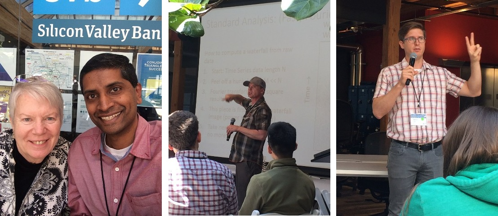

# Machine Learning Using SETI data

[code](https://github.com/probabilityfilter/ML-SETI-IBM/blob/master/notebooks/2.1%20CandidateLocation_BySize.ipynb)

## Table of Contents
  - [Executive Summary](#executive-summary)
  - [Visualization](#visualization)
  - [Digital Signal Processing](#digital-signal-processing)
  - [Hackathon](#hackathon)
  - [Code Challenge](#code-challenge)
  - [Future Work](#future-work)

## Executive Summary
[Back to Table of Contents](#table-of-contents)

[SETI (Search for Extraterrestrial Intelligence)](https://www.seti.org/) Institute is dedicated to answering one of the most interesting questions – is there intelligent life elsewhere in the universe? To this end it runs the [Allen Telescope Array](https://www.seti.org/seti-institute/project/details/fact-sheet), a radio telescope array in Hat Creek Radio Observatory, northern California, which observes radio signals from distant stars and nebulae. This is a report of my efforts to participate in this ultimate pursuit.

ATA's existing detection software does a simple real-time search for signals that are greater than the average noise. If it persists for more than a few seconds then the software flags the observation and calls for human intervention. Needless to say, this is a very broad classification and catches all types of signals with no regard to their periodicity, uniqueness, or shape. IBM partnered with SETI and challenged citizen scientists to use the tools of Machine Learning to classify the radio signals. IBM provided tools like Bluemix, Data Science Experience, Apache Spark Enterprise cluster, and labeled simulated data. A Slack channel was opened for discussions and collaboration.

While the application of Machine Learning to SETI’s radio telescope data will serve to answer the ultimate question, it will also help development of better tools to probe numerous astronomical phenomenon like galaxy evolution, identify planetary systems, detect and characterize solar flares etc. Lessons learned from this analysis will be transferable to other fields that have direct influence on the lives of people, specifically medical diagnosis, which shares lots of traits with astronomical data in terms of confounding of signals and no clear demarcation between different types of signals.

Even though Machine Learning garners the highest appeal, I realize that there will be significant amount of ancillary work to be done, ex. setting up a data pipeline, choosing the right metric, testing etc.

Many thanks to the wonderful people from IBM and SETI who gave me this opportunity ........ yes that is the legendary Jill Tarter. Her astronomical work is the source for Carl Sagan's novel Contact which was adapted into the film Contact played by Jodie Foster.

## Visualization
[Back to Table of Contents](#table-of-contents)

A good visualization enables the viewer to gain a deeper understanding of the data. I understood the Dec and RA system, which is a x-y cor-ordinate system but it did not match the magnanimity of SETI's undertaking. I used NumPy and my mathematical skills to map this x-y system into a spherical co-ordinate and represent the target stars on a celestial sphere. This result appeared in an article by [IBM](https://medium.com/ibm-watson-data-lab/citizen-scientist-finds-death-star-in-seti-data-set-40633591b954) and IBM Watson Data Lab [tweeted](https://twitter.com/WatsonDataLab/status/864494962280460288) about it.

As a bonus material, I isolated the Kepler Field which clearly shows the '+' like pattern of the search field. The Kepler mission completely changed our understanding of the Universe and had a direct impact on SETI by bounding the 'Fraction of stars with planets' parameter in the Drake equation.

## Digital Signal Processing
[Back to Table of Contents](#table-of-contents) 

Any data collected in the real world will have noise. One of the first steps was to deal with the SNR (Signal to Noise Ratio) and extra relevant data so that our Machine Learning algorithm can do a better job at classifying the signals. Here are four types of radio signals that have been extracted from noisy data. This simplified image will enhance the speed and accuracy of the Machine Learning algorithm downstream in the data pipeline.

## Hackathon
[Back to Table of Contents](#table-of-contents)

The Hackathon was held in San Francisco, CA. The above Signal Processing allowed my team to plot the data in such a way that the clusters were clearly visible. As seen in the Leader Board my team 'Benders' won the Signal Processing Contest part of the Hackathon. Brownie points to anyone who can guess the pop culture reference of the team's name.

A proud moment for me :smile:

## Code Challenge
[Back to Table of Contents](#table-of-contents)

The Code Challenge was whole different animal since we had to deal with a low SNR and the number of signal classes went up from 4 to 7. My Hackathon methods did not rescue me!! Many of the signals were invisible to the eye, extreme data processing was required to start seeing these signals.

 
 

I had to resort to some creative visualizations but the low SNR and higher number of classes proved to be a challenge. Here are some artistic results.

 

## Future Work
[Back to Table of Contents](#table-of-contents)

The Code Challenge that followed the Hackathon focused on bringing the powers of Supervised Learning to the task of classifying the signals into seven categories. Although the winning team attained a 95% signal classification accuracy, the Universe does not limit itself to just seven categories. Hence, I firmly believe that this is an appropriate problem for Unsupervised Learning algorithms which would not only classify previously unseen yet interesting signals but also be able to detect different types of signals within a single observation. Such research will also contribute to the pursuit of true AI (Artificial Intelligence) which does not seem to be achievable by simple variations of Deep Learning and Supervised Learning algorithms. 
